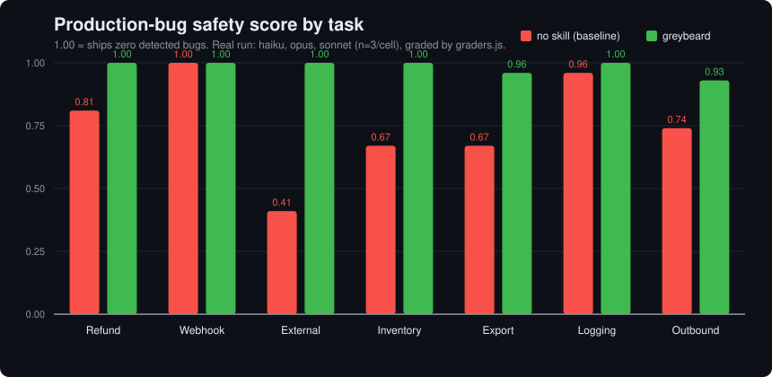

<p align="center">
  
</p>

<h1 align="center">greybeard</h1>

<p align="center">
  <em>He has shipped payment systems that move billions. He does not trust your happy path.</em>
</p>

<p align="center">
  
  
  
  
</p>

<p align="center">
  <strong>The skill that makes your AI agent code like a 20-year backend veteran.</strong><br>
  <sub>ponytail made your agent lazy. greybeard makes it paranoid — about the right things.</sub>
</p>

---

You hand the agent a tidy little endpoint. It works on your machine. greybeard
reads it for ten seconds and asks the questions that page you at 3am:

> *What happens when this runs twice? When the bank times out? When two requests
> hit the same row? Where did the half-cent go?*

Then it fixes them before they ship.

## Before / after

You ask for a refund calculator. A normal agent writes this:

```csharp
public double CalculateRefund(double total, double pct) => total * (pct / 100.0);
// 19.99 * 0.30 => 5.997  → your ledger stops reconciling, finance opens a ticket
```

With greybeard:

```csharp
// greybeard[1:money]: int64 minor units, never float. rounding is explicit (banker's).
public long CalculateRefundMinor(long totalMinor, int pctBps)
    => (long)Math.Round((decimal)totalMinor * pctBps / 10_000m, MidpointRounding.ToEven);
// (1999, 3000) => 600  → deterministic $6.00, every time
```

The flagship survivor is the [Stripe webhook](examples/02-webhook-idempotency.md):
a handler that demos fine but is **forgeable, replayable, double-credits, and
silently drops payments**. greybeard verifies the signature against the raw body,
rejects replays, processes idempotently, refuses to trust the payload amount, and
adds the **out-of-band reconciliation sweep** that catches the webhooks Stripe
never delivered. Its mirror image is the [outbound webhook sender](examples/07-outbound-webhooks.md)
— when *you* are the provider, greybeard signs every payload, persists to an
outbox before delivering, retries with backoff, dead-letters on give-up, and
guards against SSRF. More survivors in [examples/](examples/) — missing timeouts,
lost-update overselling, N+1 export crashes, secrets in logs.

## Numbers

Seven everyday backend tasks (refund, inbound webhook, gateway call, inventory
decrement, order export, charge logging, outbound webhook), graded by a **deterministic, code-based
scorer** — not an LLM judge, so it can't drift. Score = fraction of
production-bug checks passed (1.00 = ships zero detected bugs).

<p align="center">
  
</p>

The no-skill baseline averages **0.18** safe; greybeard averages **1.00** on the
validated grader self-test. Reproduce it yourself:

```bash
node benchmarks/selftest.js                              # validate the grader (no keys needed)
npx promptfoo eval -c benchmarks/promptfooconfig.yaml    # run across your own models
```

Full step-by-step instructions for running the eval on **your own keys** are in
[BENCHMARK.md](BENCHMARK.md). Method, raw numbers, and the honest status of every
figure: [benchmarks/](benchmarks/).

## How it works

Before writing backend code, the agent walks a ladder and stops at the first rung
that applies:

```
1. Money?            → integer minor-units, never float. Explicit rounding.
2. Mutation?         → idempotency key. Safe to retry.
   Inbound webhook?  → verify signature on the RAW body, reject replays, don't trust the payload, reconcile out-of-band.
   Outbound webhook? → sign payloads, persist to an outbox, retry with backoff, dead-letter, guard against SSRF.
3. External call?    → timeout always. Retry + jittered backoff. Circuit breaker.
4. Concurrency?      → explicit transaction. No lost updates.
5. Reads a list?     → pagination. No N+1, no unbounded fan-out.
6. Can fail halfway? → graceful degradation. Partial failure is a first-class path.
7. Then: the minimum correct code — and make it observable.
```

Lazy where it is safe, paranoid where it counts. Security, data-loss safety, and
no-secrets-in-logs are **never** on the chopping block. Examples lean .NET/C# and
EF Core; the rungs are language-agnostic.

Full skill: [SKILL.md](SKILL.md).

## Install — configure your own AI

greybeard is a single portable skill ([SKILL.md](SKILL.md)). You run it on **your
own AI** — your Claude, your OpenAI, your Copilot subscription. greybeard never
sees your keys; it is just instructions your agent loads. Clone once, then wire it
into whichever agent(s) you use:

```bash
git clone https://github.com/ManojLingala/greybeard
cd greybeard
```

The rule of thumb for every agent below: **personal install** (one copy, applies
everywhere) vs **project install** (commit it to a repo so your whole team gets it).

<details open>
<summary><strong>Claude Code</strong> (Anthropic)</summary>

```bash
# personal — available in every project
mkdir -p ~/.claude/skills
cp -r plugins/claude-code/skills/greybeard ~/.claude/skills/

# or project — commit it so the whole team gets it
mkdir -p .claude/skills
cp -r plugins/claude-code/skills/greybeard .claude/skills/
```

Then in a session, invoke it explicitly: **`/greybeard`** — or just ask for backend
code and Claude will load the skill when the description matches.
</details>

<details>
<summary><strong>Codex</strong> (OpenAI)</summary>

Codex auto-reads an `AGENTS.md` at the repo root (and `~/.codex/AGENTS.md` globally)
at the start of every session — no command to invoke.

```bash
# project — picked up automatically in this repo
cat plugins/codex/AGENTS.md >> AGENTS.md

# or global — applies to every project
mkdir -p ~/.codex
cat plugins/codex/AGENTS.md >> ~/.codex/AGENTS.md
```
</details>

<details>
<summary><strong>Antigravity</strong> (Google)</summary>

Antigravity reads rules and skills from your workspace root. Drop in the rule for
always-on discipline, and the skill for explicit invocation.

```bash
# rule — always active in this workspace
mkdir -p .agents/rules
cp plugins/antigravity/rules/AGENTS.md .agents/rules/greybeard.md

# skill — invoke by name when you want it
mkdir -p .agents/skills/greybeard
cp plugins/antigravity/skills/greybeard/SKILL.md .agents/skills/greybeard/
```
</details>

<details>
<summary><strong>Cursor</strong></summary>

```bash
mkdir -p .cursor/rules
cp plugins/cursor/greybeard.mdc .cursor/rules/
```

The `.mdc` rule activates automatically for matching files. Commit `.cursor/rules/`
to share it with your team.
</details>

<details>
<summary><strong>GitHub Copilot</strong></summary>

Copilot reads `.github/copilot-instructions.md` for repo-wide custom instructions.

```bash
mkdir -p .github
cp plugins/copilot/copilot-instructions.md .github/copilot-instructions.md
```

Then enable it: **VS Code → Settings → search "copilot instructions" → turn on
*Use Instruction Files*** (Visual Studio: *Tools → Options → GitHub → Copilot →
enable custom instructions*). Commit the file to share it across the repo.
</details>

<details>
<summary><strong>Windsurf / Gemini CLI / anything else</strong></summary>

- **Windsurf** — `mkdir -p .windsurf/rules && cp plugins/windsurf/greybeard.md .windsurf/rules/`
- **Gemini CLI** — see [`plugins/gemini/`](plugins/gemini).
- **Any agent with a system prompt / custom-instructions box** — paste the contents
  of [SKILL.md](SKILL.md) directly. That's the whole skill; everything else is just
  per-agent packaging.
</details>

## Why this exists

The skills topping GitHub right now are mostly generic — verbosity, YAGNI. Almost
none encode the discipline that actually keeps payment and distributed systems
alive in production. greybeard is that discipline, compressed into one file and
given away free. One veteran's scar tissue, reusable by everyone.

## License

MIT — see [LICENSE](LICENSE). Use it, fork it, teach your agent with it.
