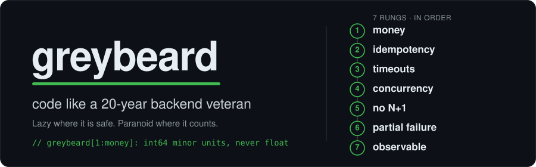

<p align="center">
  
</p>

<p align="center">
  
  
  
  
  
</p>

<p align="center">
  <strong>One portable <code>SKILL.md</code> that makes your AI agent paranoid about the right things.</strong><br>
  <sub>Money, idempotency, timeouts, concurrency — handled before it ships. Lazy where it's safe, sharp where it counts. Works with Claude Code, Codex, Cursor, Copilot &amp; more.</sub>
</p>

---

You hand the agent a tidy little endpoint. It works on your machine. greybeard
reads it for ten seconds and asks the questions that page you at 3am:

> *What happens when this runs twice? When the bank times out? When two requests
> hit the same row? Where did the half-cent go?*

Then it fixes them before they ship — marking each defensive choice with a one-line
`greybeard:` comment that names the 3am page it just saved you.

## Before / after

You ask for a refund calculator. A normal agent writes this:

```csharp
public double CalculateRefund(double total, double pct) => total * (pct / 100.0);
// 19.99 * 0.30 => 5.997  → your ledger stops reconciling, finance opens a ticket
```

With greybeard:

```csharp
// greybeard[1:money]: int64 minor units, never float. rounding is explicit (banker's).
public long CalculateRefundMinor(long totalMinor, int pctBps)
    => (long)Math.Round((decimal)totalMinor * pctBps / 10_000m, MidpointRounding.ToEven);
// (1999, 3000) => 600  → deterministic $6.00, every time
```

The flagship survivor is the [Stripe webhook](examples/02-webhook-idempotency.md):
a handler that demos fine but is **forgeable, replayable, double-credits, and
silently drops payments**. greybeard verifies the signature against the raw body,
rejects replays, processes idempotently, refuses to trust the payload amount, and
adds the **out-of-band reconciliation sweep** that catches the webhooks Stripe
never delivered. Its mirror image is the [outbound webhook sender](examples/07-outbound-webhooks.md)
— when *you* are the provider, greybeard signs every payload, persists to an
outbox before delivering, retries with backoff, dead-letters on give-up, and
guards against SSRF. More survivors in [examples/](examples/) — missing timeouts,
lost-update overselling, N+1 export crashes, secrets in logs.

## It's not hypothetical — it found real bugs

The benchmark below is synthetic, so we pointed greybeard's lens at two of the most
popular open-source money-movers — [Hyperswitch](https://github.com/juspay/hyperswitch)
(Rust payments switch) and [Medusa](https://github.com/medusajs/medusa) (commerce
platform) — with an automated *find → adversarially-verify* pass. **Every one of
greybeard's seven rungs matched real production code** — including an `f64` surcharge
calc we reproduced as off by a full minor unit, and payment-path calls with no timeout.

These are well-engineered projects that already do most things right, so most flags come
back "already handled" (which itself validates the checklist) — we publish only the
verified residue. We even opened the fixes upstream:
[hyperswitch#12853](https://github.com/juspay/hyperswitch/pull/12853) ·
[medusa#15792](https://github.com/medusajs/medusa/pull/15792).

Verified, non-security findings with `file:line` and minimal fixes →
**[case-studies/](case-studies/)**. (Security-sensitive candidates go to maintainers
privately, never published.)

## Numbers

Seven everyday backend tasks (refund, inbound webhook, gateway call, inventory
decrement, order export, charge logging, outbound webhook), graded by a
**deterministic, code-based scorer** — not an LLM judge, so it can't drift. Score
= fraction of production-bug checks passed (1.00 = ships zero detected bugs).

<p align="center">
  
</p>

Real run across three Claude models — **Haiku, Sonnet, Opus**, three samples each,
**189 generations** ([raw generations + full report](benchmarks/results/)):

| Model | no skill | greybeard |
|-------|---------:|----------:|
| Haiku  | 0.61 | **0.97** |
| Sonnet | 0.73 | **1.00** |
| Opus   | 0.91 | **0.98** |
| **All** | **0.75** | **0.98** |

greybeard drives every model to ~1.00. The gain is biggest exactly where the
naive ask hides the danger — *"charge a card over HTTP"* averages **0.41** without
the skill and **1.00** with it — and biggest on the cheaper models (Haiku
**+0.36**, vs Opus **+0.07**, which already has the instincts). The "just write the
minimum" YAGNI arm actually scores *below* no-skill on Sonnet and Opus: told to be
lazy, the model strips the guards. greybeard is the opposite bias — paranoid where
it counts.

Reproduce it yourself:

```bash
node benchmarks/selftest.js                                          # validate the grader (no keys)
node benchmarks/grade_batch.js benchmarks/results/raw-2026-06-20/    # re-grade the committed run
npx promptfoo eval -c benchmarks/promptfooconfig.yaml                # run across your own models/keys
```

Full method, raw numbers, per-task breakdown, and the honest status of every
figure: [benchmarks/results/](benchmarks/results/) and [BENCHMARK.md](BENCHMARK.md).

## How it works

Before writing backend code, the agent walks a ladder and stops at the first rung
that applies:

```
1. Money?            → integer minor-units, never float. Explicit rounding.
2. Mutation?         → idempotency key. Safe to retry.
   Inbound webhook?  → verify signature on the RAW body, reject replays, don't trust the payload, reconcile out-of-band.
   Outbound webhook? → sign payloads, persist to an outbox, retry with backoff, dead-letter, guard against SSRF.
3. External call?    → timeout always. Retry + jittered backoff. Circuit breaker.
4. Concurrency?      → explicit transaction. No lost updates.
5. Reads a list?     → pagination. No N+1, no unbounded fan-out.
6. Can fail halfway? → graceful degradation. Partial failure is a first-class path.
7. Then: the minimum correct code — and make it observable.
```

Lazy where it is safe, paranoid where it counts. Security, data-loss safety, and
no-secrets-in-logs are **never** on the chopping block. The examples lean .NET/C# and
EF Core, but the rungs are language-agnostic — we field-tested them on **Rust**
(Hyperswitch) and **TypeScript** (Medusa) above.

Full skill: [SKILL.md](SKILL.md).

## Install

greybeard is a single portable skill ([SKILL.md](SKILL.md)) you run on **your own AI** —
your Claude, your OpenAI, your Copilot subscription. It never sees your keys; it is just
instructions your agent loads.

**Fastest path — Claude Code (30 seconds):**

```bash
git clone https://github.com/ManojLingala/greybeard && cd greybeard
mkdir -p ~/.claude/skills && cp -r plugins/claude-code/skills/greybeard ~/.claude/skills/
```

Then ask for backend code, or invoke it explicitly with **`/greybeard`**. Using a
different agent? Each one's setup is below — the rule of thumb is **personal install**
(one copy, applies everywhere) vs **project install** (commit it so your whole team gets it).

<details open>
<summary><strong>Claude Code</strong> (Anthropic)</summary>

```bash
# personal — available in every project
mkdir -p ~/.claude/skills
cp -r plugins/claude-code/skills/greybeard ~/.claude/skills/

# or project — commit it so the whole team gets it
mkdir -p .claude/skills
cp -r plugins/claude-code/skills/greybeard .claude/skills/
```

Then in a session, invoke it explicitly: **`/greybeard`** — or just ask for backend
code and Claude will load the skill when the description matches.
</details>

<details>
<summary><strong>Codex</strong> (OpenAI)</summary>

Codex auto-reads an `AGENTS.md` at the repo root (and `~/.codex/AGENTS.md` globally)
at the start of every session — no command to invoke.

```bash
# project — picked up automatically in this repo
cat plugins/codex/AGENTS.md >> AGENTS.md

# or global — applies to every project
mkdir -p ~/.codex
cat plugins/codex/AGENTS.md >> ~/.codex/AGENTS.md
```
</details>

<details>
<summary><strong>Antigravity</strong> (Google)</summary>

Antigravity reads rules and skills from your workspace root. Drop in the rule for
always-on discipline, and the skill for explicit invocation.

```bash
# rule — always active in this workspace
mkdir -p .agents/rules
cp plugins/antigravity/rules/AGENTS.md .agents/rules/greybeard.md

# skill — invoke by name when you want it
mkdir -p .agents/skills/greybeard
cp plugins/antigravity/skills/greybeard/SKILL.md .agents/skills/greybeard/
```
</details>

<details>
<summary><strong>Cursor</strong></summary>

```bash
mkdir -p .cursor/rules
cp plugins/cursor/greybeard.mdc .cursor/rules/
```

The `.mdc` rule activates automatically for matching files. Commit `.cursor/rules/`
to share it with your team.
</details>

<details>
<summary><strong>GitHub Copilot</strong></summary>

Copilot reads `.github/copilot-instructions.md` for repo-wide custom instructions.

```bash
mkdir -p .github
cp plugins/copilot/copilot-instructions.md .github/copilot-instructions.md
```

Then enable it: **VS Code → Settings → search "copilot instructions" → turn on
*Use Instruction Files*** (Visual Studio: *Tools → Options → GitHub → Copilot →
enable custom instructions*). Commit the file to share it across the repo.
</details>

<details>
<summary><strong>Windsurf / Gemini CLI / anything else</strong></summary>

- **Windsurf** — `mkdir -p .windsurf/rules && cp plugins/windsurf/greybeard.md .windsurf/rules/`
- **Gemini CLI** — see [`plugins/gemini/`](plugins/gemini).
- **Any agent with a system prompt / custom-instructions box** — paste the contents
  of [SKILL.md](SKILL.md) directly. That's the whole skill; everything else is just
  per-agent packaging.
</details>

## Why this exists

The skills topping GitHub right now are mostly generic — verbosity, YAGNI. Almost
none encode the discipline that actually keeps payment and distributed systems
alive in production. greybeard is that discipline, compressed into one file and
given away free. One engineer's scar tissue, reusable by everyone.

## Contributing

New survivors, grader checks, and plugin syncs are welcome. The grader stays
deterministic and every change keeps `npm run check` green. See
[CONTRIBUTING.md](CONTRIBUTING.md).

## License

MIT — see [LICENSE](LICENSE). Use it, fork it, teach your agent with it.
